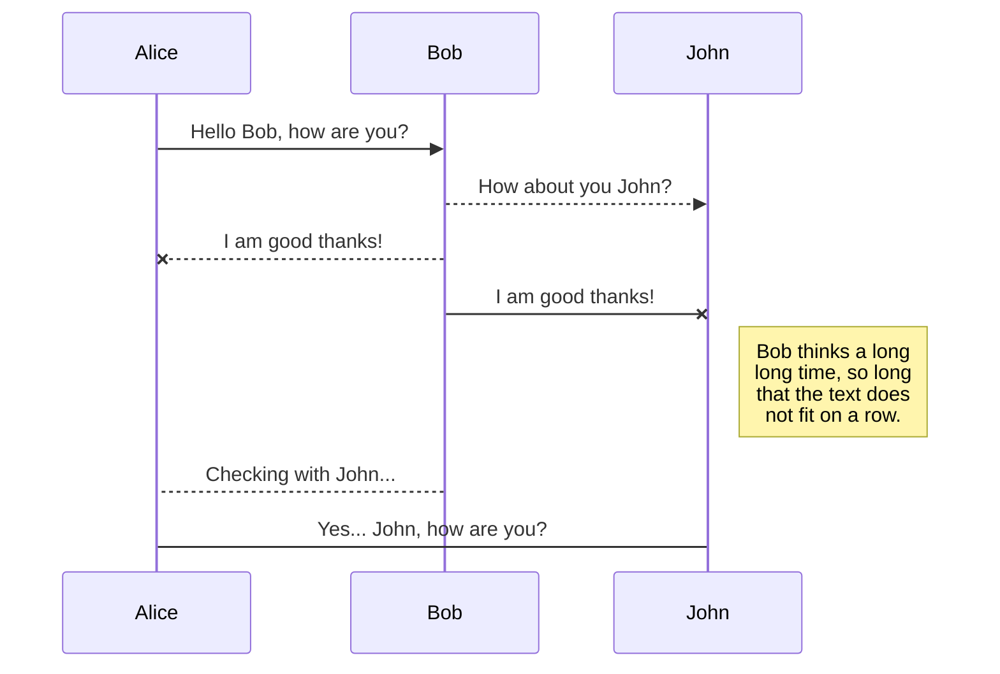
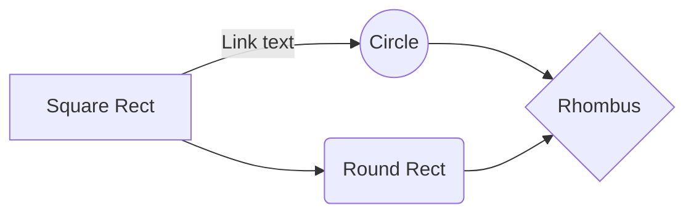

# Bienvenido al archivo de Instalcion del API REST de suma mas porcentaje de Carlos Moreno!

En este archivo readme veremos las características del API, su instalación con docker, su uso con postman o swagger-ui y algunas otras caracteristicas.

# Caracteristicas

Esta API REST esta d esarollada con el framework Spring Boot utilizando java 17 y posee las siguientes funcionalidades:

Contiene un servicio llamado por api-rest que recibe 2 números, los suma, y le aplique una suma de un porcentaje que debe ser adquiere de un servicio externo (por ejemplo, si el servicio recibe 5 y 5 como valores, y el porcentaje devuelto por el servicio externo es 10, entonces (5 + 5) + 10% = 11). 

Esta API tiene las siguientes funcionalidades:

1. Ya desplegado se puede consultar el siguiente endpoint **/api/sum**
2. El servicio externo es un mock, y devuelve el % sumado.
3. Dado que ese % varía poco, podemos considerar que el valor que devuelve ese servicio no va cambiar por 30 minutos.
4. Se puede simular que el servicio externo falle con el endpoint **/api/simulate** y se ejecuta de la siguiente manera para simular que falla:		
		4.Para reanudar el servicio se ejecuta dela siguiente manera:	
		
5. Si el servicio falla, se puede reintentar consultar hasta 3 veces, luego de esto se mostrará el siguiente error.

6.El Historial de todos los llamados a todos los endpoint se guarda en una BD PostgreSQL junto con la respuesta en caso de haber sido exitoso o fallido. 
6. El historial de los llamados a los endpoint se pueden consultar en este endpoint **/api/history/** este respondera con un Json, con data paginada con la opcion de la pagina y la cantidad de registros por pagina asi:

7. El guardado del historial de llamadas no suma tiempo al servicio invocado.
8. La API soporta como máximo 3 rpm (request / minuto), en caso de superar ese umbral se retorna un error con el código http "429  Too Many Requests" y el mensaje "Se ha superado el límite de solicitudes por minuto. Vuelva a intentarlo en xx segundos." La API espera 1 minuto para poder reanudar las consultas y muestra con un conteo regresivo cada vez que se consulta el tiempo restante para poder usar.

9. El api incluye tests unitarios en la clase **ApiSumaApplicationTests**, se pueden ejecutar con el comando de generación del jar:

Aquí el resultado:

10. Esta API puede ser desplegada en un docker container. Este docker está en un dockerhub público. La base de datos se puede correr en un contenedor docker. A continuacion archivo docker compose:

4-El proyecto contiene Swagger con las librerias **springdoc-openapi-starter-webmvc-ui** y  **springdoc-openapi-starter-webmvc-api** para probar la API y se puede probar ejecutando localmente con **mvn spring-boot:run** o desde docker. La ulr es **http://localhost:8085/swagger-ui/index.html#/** y se muestra así:

11. En la carpeat de la raiz del proyecto también podemos encontrar un archivo  **postman_collection.json** que podemos abrir con Postman dekstop para probar el api. Revisar si esta despelgado en docker o local por que puede varias el puerto del endpoint.
 
5-El código esta disponible en un repositorio público de gitHub en el link *https://github.com/CharlieJEE/apiSuma**

## Instalación
Empecemos bajando el código del repositorio de Git:

The file explorer is accessible using the button in left corner of the navigation bar. You can create a new file by clicking the **New file** button in the file explorer. You can also create folders by clicking the **New folder** button.

## Switch to another file

All your files and folders are presented as a tree in the file explorer. You can switch from one to another by clicking a file in the tree.

## Rename a file

You can rename the current file by clicking the file name in the navigation bar or by clicking the **Rename** button in the file explorer.

## Delete a file

You can delete the current file by clicking the **Remove** button in the file explorer. The file will be moved into the **Trash** folder and automatically deleted after 7 days of inactivity.

## Export a file

You can export the current file by clicking **Export to disk** in the menu. You can choose to export the file as plain Markdown, as HTML using a Handlebars template or as a PDF.

# Synchronization

Synchronization is one of the biggest features of StackEdit. It enables you to synchronize any file in your workspace with other files stored in your **Google Drive**, your **Dropbox** and your **GitHub** accounts. This allows you to keep writing on other devices, collaborate with people you share the file with, integrate easily into your workflow... The synchronization mechanism takes place every minute in the background, downloading, merging, and uploading file modifications.

There are two types of synchronization and they can complement each other:

- The workspace synchronization will sync all your files, folders and settings automatically. This will allow you to fetch your workspace on any other device.
	> To start syncing your workspace, just sign in with Google in the menu.

- The file synchronization will keep one file of the workspace synced with one or multiple files in **Google Drive**, **Dropbox** or **GitHub**.
	> Before starting to sync files, you must link an account in the **Synchronize** sub-menu.

## Open a file

You can open a file from **Google Drive**, **Dropbox** or **GitHub** by opening the **Synchronize** sub-menu and clicking **Open from**. Once opened in the workspace, any modification in the file will be automatically synced.

## Save a file

You can save any file of the workspace to **Google Drive**, **Dropbox** or **GitHub** by opening the **Synchronize** sub-menu and clicking **Save on**. Even if a file in the workspace is already synced, you can save it to another location. StackEdit can sync one file with multiple locations and accounts.

## Synchronize a file

Once your file is linked to a synchronized location, StackEdit will periodically synchronize it by downloading/uploading any modification. A merge will be performed if necessary and conflicts will be resolved.

If you just have modified your file and you want to force syncing, click the **Synchronize now** button in the navigation bar.

> **Note:** The **Synchronize now** button is disabled if you have no file to synchronize.

## Manage file synchronization

Since one file can be synced with multiple locations, you can list and manage synchronized locations by clicking **File synchronization** in the **Synchronize** sub-menu. This allows you to list and remove synchronized locations that are linked to your file.

# Publication

Publishing in StackEdit makes it simple for you to publish online your files. Once you're happy with a file, you can publish it to different hosting platforms like **Blogger**, **Dropbox**, **Gist**, **GitHub**, **Google Drive**, **WordPress** and **Zendesk**. With [Handlebars templates](http://handlebarsjs.com/), you have full control over what you export.

> Before starting to publish, you must link an account in the **Publish** sub-menu.

## Publish a File

You can publish your file by opening the **Publish** sub-menu and by clicking **Publish to**. For some locations, you can choose between the following formats:

- Markdown: publish the Markdown text on a website that can interpret it (**GitHub** for instance),
- HTML: publish the file converted to HTML via a Handlebars template (on a blog for example).

## Update a publication

After publishing, StackEdit keeps your file linked to that publication which makes it easy for you to re-publish it. Once you have modified your file and you want to update your publication, click on the **Publish now** button in the navigation bar.

> **Note:** The **Publish now** button is disabled if your file has not been published yet.

## Manage file publication

Since one file can be published to multiple locations, you can list and manage publish locations by clicking **File publication** in the **Publish** sub-menu. This allows you to list and remove publication locations that are linked to your file.

# Markdown extensions

StackEdit extends the standard Markdown syntax by adding extra **Markdown extensions**, providing you with some nice features.

> **ProTip:** You can disable any **Markdown extension** in the **File properties** dialog.

## SmartyPants

SmartyPants converts ASCII punctuation characters into "smart" typographic punctuation HTML entities. For example:

|                |ASCII                          |HTML                         |
|----------------|-------------------------------|-----------------------------|
|Single backticks|`'Isn't this fun?'`            |'Isn't this fun?'            |
|Quotes          |`"Isn't this fun?"`            |"Isn't this fun?"            |
|Dashes          |`-- is en-dash, --- is em-dash`|-- is en-dash, --- is em-dash|

## KaTeX

You can render LaTeX mathematical expressions using [KaTeX](https://khan.github.io/KaTeX/):

The *Gamma function* satisfying $\Gamma(n) = (n-1)!\quad\forall n\in\mathbb N$ is via the Euler integral

$$
\Gamma(z) = \int_0^\infty t^{z-1}e^{-t}dt\,.
$$

> You can find more information about **LaTeX** mathematical expressions [here](http://meta.math.stackexchange.com/questions/5020/mathjax-basic-tutorial-and-quick-reference).

## UML diagrams

You can render UML diagrams using [Mermaid](https://mermaidjs.github.io/). For example, this will produce a sequence diagram:

And this will produce a flow chart:

